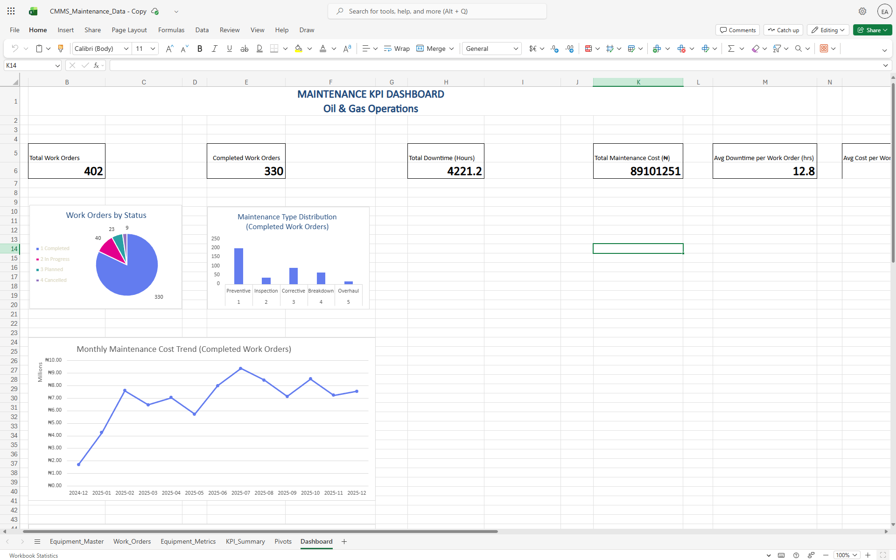

# Maintenance Analytics Dashboard

## Overview
This project presents a CMMS-style maintenance analytics dashboard designed to reflect real-world oil and gas maintenance operations.

The dashboard provides an executive-level view of maintenance performance, combining workload, downtime, cost, and reliability indicators to support maintenance planning, execution monitoring, and asset performance analysis.

## Dashboard Overview

## Purpose
This project was built to demonstrate practical understanding of maintenance planning and CMMS data analysis, with a focus on:

- Maintenance workload and execution status
- Preventive vs reactive maintenance strategy
- Downtime and cost impact on operations
- Identification of high-risk equipment

While the data is synthetic, the KPIs, structure, and analysis approach directly mirror real CMMS reporting workflows.

## Features

### 1. Work Orders by Status
- Displays distribution of work orders across lifecycle stages
- Completed, In Progress, Planned, Cancelled
- Provides immediate visibility into backlog and execution health

### 2. Maintenance Type Distribution (Bar Chart)
- Analyzes completed work orders by maintenance type
- Categories: Preventive, Inspection, Corrective, Breakdown, Overhaul
- Critical for understanding preventive vs reactive maintenance ratios

### 3. Top 10 Equipment by Downtime (Horizontal Bar Chart)
- Identifies equipment with highest downtime hours
- Enables prioritization of problem equipment
- Supports reliability improvement initiatives

### 4. Monthly Maintenance Cost Trend (Line Chart)
- Tracks maintenance spending over time
- Identifies cost patterns and seasonal variations
- Supports budget planning and cost control

## Data Structure
Dashboard uses realistic oil & gas maintenance data including:
- 30 equipment items (pumps, compressors, heat exchangers, etc.)
- 500+ work orders spanning 12 months
- Equipment metrics (MTBF, MTTR, availability)
- Cost tracking (labor + materials)
- Downtime recording

## Technical Implementation
- **Platform:** Microsoft Excel (Online)
- **Data Modeling:** Structured tables separating transactional and aggregated data
- **Analysis Engine:** Pivot tables and calculated KPIs
- **Interactivity:** Slicers for execution-state filtering
- **Data Generation:** Python (pandas, numpy) for realistic CMMS data simulation
- The dataset was generated using a reproducible Python script (`generate_maintenance_data.py`) to simulate realistic oil and gas maintenance activity.

This structure mirrors how maintenance data is modeled in enterprise CMMS and BI tools.

## Key Metrics Tracked
- Total and completed work orders
- Maintenance backlog and execution status
- Total downtime hours
- Total maintenance cost
- Average downtime per work order
- Average cost per work order
- Preventive vs breakdown maintenance ratio
- Equipment-level downtime concentration
- Reliability indicators (MTBF, MTTR, availability)

## Design Decisions
- KPIs were intentionally limited to avoid overloading the dashboard
- Reliability metrics (MTBF, MTTR, availability) are calculated but kept out of the executive view
- Explicit sort keys were used to ensure charts reflect maintenance strategy rather than fluctuating volumes
- Equipment-level metrics were separated from transactional work orders to prevent double counting

## Relevance to Maintenance Planning and CMMS Roles
This dashboard demonstrates the ability to:
- Interpret CMMS data in an operational context
- Evaluate maintenance strategy effectiveness
- Identify reliability risks and cost drivers
- Communicate maintenance performance to non-technical stakeholders
- Build scalable reporting structures suitable for CMMS and BI platforms

## Future Enhancements
- Integration with real CMMS/SAP PM data
- Automated data refresh capabilities
- Drill-down functionality for detailed analysis
- Resource utilization tracking
- Schedule compliance metrics

## Author
**Ekemini Umanah**  
Computer Scientist | Data Analyst  
Developing expertise in maintenance analytics and planning

## Note
This project uses synthetic but realistic data to demonstrate maintenance analytics concepts. The KPIs, workflows, and reporting logic are directly applicable to real CMMS environments such as SAP PM, IBM Maximo, or Power BI–based reporting layers.

